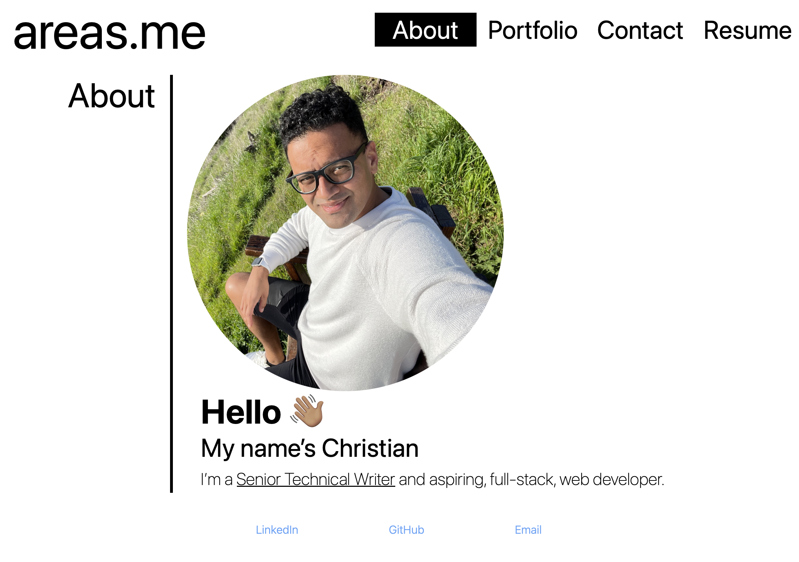

# Christian’s React Portfolio
## Description
A [simple portfolio](https://areas-boot-camp-challenges.github.io/20-react-portfolio/) built with React!

## Table of Contents
- [Features](#features)
- [Installation](#installation)
- [Usage](#usage)
- [Contribute](#contribute)
- [Tests](#tests)
- [Credits](#credits)
- [License](#license)
- [Questions](#questions)

## Features
It’s a single page web app that:
- Tells users about me.
- Showcases some of my projects.
- Lets them reach out via a contact form (backend work to complete pending).
- Lets them download my resume.

## Installation
Clone the repo and run `npm i`.

## Usage
Run `npm start` and visit [http://localhost:3000/](http://localhost:3000/).

## Contribute
Open a PR.

## Tests
Try your changes before you push to GitHub.

## Credits
- Tailwind CSS.
- React.
- GitHub Pages.

## License
See [LICENSE (GNU GPLv3)](./LICENSE).

## Questions
Reach out with questions:

- GitHub: [github.com/areas-boot-camp-challenges](https://github.com/areas-boot-camp-challenges)
- Email: [me@areas.me](mailto:me@areas.me)
